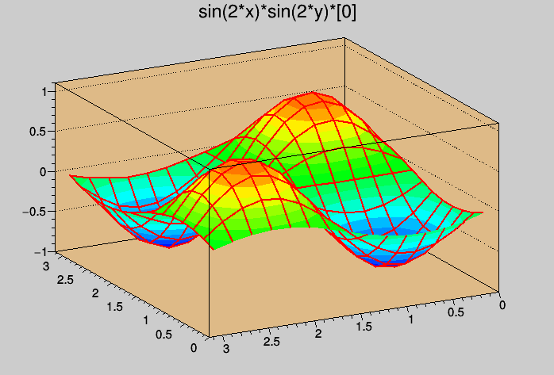

# 2D Standing Waves

## 목표

ROOT를 이용하여 2D 정상파의 모습을 시뮬레이션 하는 프로그램이다.

## 예시

<iframe width="480" height="360" src="https://www.youtube.com/embed/pBzQIfjPs-U" title="YouTube video player" frameborder="0" allow="accelerometer; autoplay; clipboard-write; encrypted-media; gyroscope; picture-in-picture" allowfullscreen></iframe>

  

## License

© Youngcheor Ra